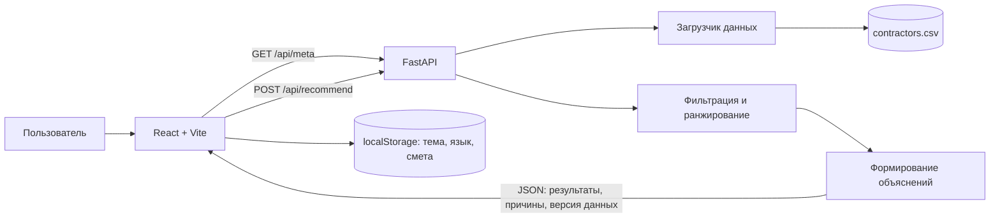

# HelpHunter

**HelpHunter** — веб-сервис для подбора подрядчиков на мероприятия. Организатор задаёт город, дату, формат события, нужную категорию, бюджет и дополнительные условия, а сервис проверяет каталог и возвращает до трёх подходящих вариантов с объяснением выбора.

Проект создан командой **HackAlem** для хакатона QLCD.

> Текущая версия работает с локальным каталогом из 66 профилей. Она помогает сформировать короткий список и предварительную смету, но не выполняет бронирование и оплату.

## Содержание

- [Проблема и целевая аудитория](#проблема-и-целевая-аудитория)
- [Что реализовано](#что-реализовано)
- [Как работает решение](#как-работает-решение)
- [Технологии](#технологии)
- [Архитектура](#архитектура)
- [Установка и запуск](#установка-и-запуск)
- [Как проверить решение](#как-проверить-решение)
- [API](#api)
- [Данные и интеграции](#данные-и-интеграции)
- [Тесты](#тесты)
- [Ограничения](#ограничения)
- [Развёрнутая версия](#развёрнутая-версия)

## Проблема и целевая аудитория

При подготовке мероприятия организатору приходится вручную просматривать множество профилей и отдельно сравнивать стоимость, доступность, формат работы, язык и допустимую длительность. Это занимает время, а причина выбора конкретного подрядчика часто остаётся непрозрачной.

HelpHunter решает эту задачу для:

- организаторов свадеб, корпоративов, конференций, дней рождения и других событий;
- event-менеджеров, которым нужно быстро собрать первичный список исполнителей;
- заказчиков, которым важно понимать, почему профиль подходит или был исключён.

Сервис не заменяет договорённость с подрядчиком. Его задача — отфильтровать каталог, ранжировать допустимые варианты и объяснить результат.

## Что реализовано

### Подбор подрядчиков

- форма с городом, датой, типом мероприятия, категорией и бюджетом;
- дополнительные фильтры по языку и длительности;
- проверка занятости на выбранную дату;
- фильтрация по бюджету, формату события, языку и длительности;
- выдача от одного до трёх лучших профилей;
- детерминированное ранжирование: одинаковый запрос и одна версия данных дают одинаковый порядок;
- текстовое объяснение для каждой карточки;
- сводка причин, по которым остальные профили были исключены;
- отдельные состояния для успешной, пустой и ошибочной выдачи.

### Интерфейс

- стартовая страница HelpHunter;
- страница подбора с готовыми демонстрационными сценариями;
- страница «Смета» для сохранения выбранных подрядчиков и подсчёта стартовой суммы;
- светлая и тёмная темы;
- переключение основного интерфейса между русским, казахским и английским языками;
- адаптивная вёрстка для компьютеров и мобильных экранов;
- сохранение темы, языка и сметы в `localStorage` браузера;
- логотип и навигация между разделами без перезагрузки страницы.

### Прозрачность данных

- API сообщает версию загруженного CSV-набора;
- синтетические профили помечаются отдельно;
- для восстановленных города или цены предусмотрены флаги `city_imputed` и `price_imputed`;
- интерфейс показывает результат реального запроса к backend, а не локальную подмену выдачи.

## Как работает решение

Основной пользовательский сценарий:

1. Пользователь открывает страницу подбора.
2. Frontend получает справочники из `GET /api/meta`.
3. Пользователь указывает параметры события и нажимает **«Подобрать»**.
4. Frontend проверяет поля и отправляет `POST /api/recommend`.
5. Backend сначала выбирает профили нужного города и категории.
6. Для каждого профиля последовательно проверяются дата, бюджет, формат, язык и длительность.
7. Допустимые профили получают прозрачный числовой балл и сортируются по баллу, затем по цене и ID.
8. Пользователь видит до трёх карточек, объяснение каждой рекомендации и агрегированную статистику исключений.
9. Нужные карточки можно добавить в «Смету». Смета хранится только в текущем браузере.

Порядок проверки ограничений в backend — **first-failure**: для одного исключённого профиля учитывается первая обнаруженная причина.

## Технологии

### Frontend

- JavaScript;
- React 19.3;
- React DOM 19.3;
- Vite 8.3;
- обычный CSS без отдельного UI-фреймворка;
- Fetch API и `AbortController` для запросов и отмены;
- Vitest, Testing Library и jsdom для модульных и компонентных тестов;
- Playwright для E2E-проверок;
- ESLint для статического анализа.

### Backend

- Python 3;
- FastAPI 0.115.6;
- Uvicorn 0.34.0;
- Pydantic 2.10.5;
- стандартный модуль `csv` для чтения каталога;
- Pytest 8.3.4 для тестов.

### AI-модели и внешние сервисы

В runtime-версии проекта **нет LLM, embeddings и обращений к OpenAI, NVIDIA или другим AI API**. Подбор реализован локальным детерминированным алгоритмом. Модуль `semantic.py` анализирует текст по токенам и не вызывает внешнюю модель.

Codex использовался как инструмент при разработке и тестировании интерфейса, но не является частью работающего приложения.

## Архитектура



### Основные компоненты

```text
hack-0edd372c-qlcd/
├── backend/
│   ├── app/
│   │   ├── main.py           # FastAPI-приложение и маршруты
│   │   ├── models.py         # модели запросов и ответов Pydantic
│   │   ├── data_loader.py    # чтение и нормализация CSV
│   │   ├── recommender.py    # фильтрация, баллы и сортировка
│   │   ├── explanations.py   # объяснения рекомендаций
│   │   └── semantic.py       # детерминированный разбор текста
│   ├── data/
│   │   └── contractors.csv   # каталог подрядчиков
│   └── tests/                # тесты backend
├── frontend/
│   ├── src/
│   │   ├── components/       # страницы, форма, карточки и навигация
│   │   ├── data/             # демо-пресеты и экспорт городов
│   │   ├── hooks/            # состояние и жизненный цикл запросов
│   │   ├── tests/            # unit/component-тесты
│   │   ├── api.js            # HTTP-клиент
│   │   ├── adapters.js       # проверка и преобразование ответа API
│   │   └── App.jsx           # корневой компонент приложения
│   ├── e2e/                  # браузерные E2E-тесты
│   └── vite.config.js        # dev-сервер и proxy на backend
└── docs/                     # демо, примеры API и интеграционные заметки
```

В режиме разработки браузер обращается к `/api`, а Vite перенаправляет эти запросы на `http://127.0.0.1:8000`. Это позволяет frontend и backend работать как единое приложение без изменения URL в исходном коде.

## Установка и запуск

### Требования

- Git;
- Python 3.10 или новее; проект проверялся с Python 3.13;
- Node.js 22.12 или новее;
- npm;
- современный браузер.

### 1. Клонировать репозиторий

```bash
git clone https://github.com/BAITC-Hacks/hack-0edd372c-qlcd.git
cd hack-0edd372c-qlcd
```

Репозиторий приватный, поэтому GitHub должен предоставить вашему аккаунту доступ.

### 2. Запустить backend

Windows PowerShell:

```powershell
cd backend
py -3.13 -m venv .venv
.\.venv\Scripts\Activate.ps1
python -m pip install --upgrade pip
pip install -r requirements.txt
python -m uvicorn app.main:app --reload --host 127.0.0.1 --port 8000
```

Linux/macOS:

```bash
cd backend
python3 -m venv .venv
source .venv/bin/activate
python -m pip install --upgrade pip
pip install -r requirements.txt
python -m uvicorn app.main:app --reload --host 127.0.0.1 --port 8000
```

После запуска доступны:

- проверка состояния: http://127.0.0.1:8000/health;
- Swagger UI: http://127.0.0.1:8000/docs;
- OpenAPI-схема: http://127.0.0.1:8000/openapi.json.

### 3. Запустить frontend

Откройте второй терминал из корня репозитория:

```bash
cd frontend
npm ci
npm run dev
```

В Windows PowerShell при блокировке `npm.ps1` используйте `npm.cmd`:

```powershell
cd frontend
npm.cmd ci
npm.cmd run dev
```

Откройте http://127.0.0.1:5173.

Дополнительные переменные окружения не обязательны. Их доступные значения описаны в [`frontend/.env.example`](frontend/.env.example).

## Как проверить решение

### Быстрая проверка для жюри

1. Запустите backend и frontend по инструкции выше.
2. Откройте http://127.0.0.1:5173.
3. Нажмите **«Начать подбор»** или **«Найти подрядчика»**.
4. В блоке **«Демо-сценарии»** выберите **«A · Плотная категория»**.
5. Нажмите **«Заполнить форму»**, затем **«Подобрать»**.
6. Убедитесь, что интерфейс сообщает: найдено 5 подходящих профилей из 10 и показаны лучшие 3.
7. В подтверждённой версии набора `87d082de8481` первыми идут `HK-88430`, `HK-27222` и `HK-77838`.
8. Раскройте сведения о подборе: четыре профиля исключены из-за занятости, один — из-за превышения бюджета.
9. Добавьте одну карточку в смету и откройте раздел **«Смета»** — выбранный подрядчик и стартовая стоимость сохранятся.
10. Проверьте кнопки смены языка и темы в шапке сайта.

Параметры сценария A:

| Поле | Значение |
| --- | --- |
| Город | Алматы |
| Дата | 10.10.2026 |
| Тип мероприятия | корпоратив |
| Категория | Ведущий |
| Бюджет на подрядчика | 1 500 000 ₸ |
| Длительность | 6 часов |
| Язык | русский |

Другие готовые сценарии позволяют проверить редкую категорию, пустую выдачу, отсутствие категории в городе, изменение доступности по дате и подбор площадки. Подробности находятся в [`docs/demo.md`](docs/demo.md).

### Проверка API без интерфейса

После запуска backend выполните:

```bash
curl -X POST http://127.0.0.1:8000/api/recommend \
  -H "Content-Type: application/json" \
  -d '{
    "city": "Алматы",
    "event_date": "2026-10-10",
    "event_type": "корпоратив",
    "category": "Ведущий",
    "budget_kzt": 1500000,
    "duration_hours": 6,
    "language": "русский",
    "limit": 3
  }'
```

Ожидаемый статус ответа — `matches_found`. Полные зафиксированные примеры запросов и ответов находятся в [`docs/api-examples.json`](docs/api-examples.json).

## API

| Метод | Маршрут | Назначение |
| --- | --- | --- |
| `GET` | `/health` | состояние сервиса, число профилей и версия данных |
| `GET` | `/api/meta` | города, категории, форматы, языки и версия данных |
| `POST` | `/api/recommend` | подбор и ранжирование подрядчиков |

Основные поля запроса `POST /api/recommend`:

| Поле | Обязательное | Описание |
| --- | --- | --- |
| `city` | да | город из каталога |
| `event_date` | да | дата от `2026-09-23` до `2026-12-31` |
| `event_type` | да | формат мероприятия |
| `category` | да | категория подрядчика |
| `budget_kzt` | да | положительный целый бюджет в тенге |
| `duration_hours` | нет | положительная длительность в часах |
| `language` | нет | требуемый язык |
| `limit` | нет | число результатов от 1 до 3, по умолчанию 3 |

Возможные бизнес-статусы:

- `matches_found` — есть подходящие профили;
- `no_category_in_city` — в каталоге нет выбранной категории в этом городе;
- `no_candidates_meet_conditions` — категория существует, но все профили отсеяны условиями.

## Данные и интеграции

### Источник данных

Приложение читает только файл [`backend/data/contractors.csv`](backend/data/contractors.csv):

- 66 профилей;
- 13 профилей помечены как синтетические;
- 8 записей имеют восстановленный город;
- 18 записей имеют восстановленную цену;
- SHA-256 файла: `87d082de8481f63795ba9d5b9509b5ffbdeabe3f99efd28b114be780df35d422`;
- короткая версия набора в API: `87d082de8481`.

CSV содержит ID, анонимизированное имя, категории, город, стартовую цену, поддерживаемые форматы и языки, максимальную длительность, занятые даты, описание и признаки происхождения данных.

Календарное окно текущего набора фиксировано: **23 сентября — 31 декабря 2026 года**. Оно не зависит от сегодняшней даты.

### Внешние интеграции

Во время работы приложение не обращается к сторонним каталогам, платёжным системам, картам, CRM или AI API. Frontend взаимодействует только с собственным FastAPI backend. Все данные для подбора находятся в репозитории.

## Тесты

Backend, из каталога `backend`:

```bash
python -m pytest -q
```

Frontend, из каталога `frontend`:

```bash
npm run lint
npm test
npm run build
npm run test:e2e
```

`npm test` выполняет unit- и component-тесты без реального backend. Для `npm run test:e2e` backend должен работать на порту `8000`; Playwright проверяет настоящие HTTP-запросы и данные CSV.

Если в системе нет поддерживаемого браузера Playwright:

```bash
npx playwright install chromium
npm run test:e2e
```

## Ограничения

- Нет публичного production-развёртывания.
- Нет регистрации, авторизации и личных кабинетов.
- Нет бронирования, оплаты, договора и отправки заявки подрядчику.
- «Смета» — локальный список в браузере; она не синхронизируется с сервером и не подтверждает заказ.
- Цена в карточке — стартовая цена за мероприятие, а не окончательная стоимость и не почасовая ставка.
- Доступность определяется только полем `busy_dates` текущего CSV и не синхронизируется с внешним календарём.
- Каталог ограничен 66 профилями и фиксированным календарным периодом 2026 года.
- Основные элементы интерфейса переведены на русский, казахский и английский; отдельные сообщения backend и технической диагностики остаются на русском.
- Алгоритм не является машинным обучением: он использует жёсткие фильтры, прозрачную формулу баллов и токенизацию текста.
- Причины исключения возвращаются агрегированно, без списка причин для каждого отдельного отклонённого профиля.
- Объяснение зависит от качества исходного описания; фрагмент описания ограничивается backend.
- Dev/preview proxy Vite не является готовой production-инфраструктурой.

## Развёрнутая версия

Публичная deployed-версия **не создана**. После локального запуска доступны:

- приложение: http://127.0.0.1:5173;
- Swagger UI: http://127.0.0.1:8000/docs;
- health check: http://127.0.0.1:8000/health.

Для production frontend собирается командой `npm run build` в каталог `frontend/dist`. Статические файлы необходимо разместить на веб-сервере, а запросы `/api/` направить на FastAPI с сохранением пути. Подробности приведены в [`frontend/README.md`](frontend/README.md).

## Дополнительная документация

- [`backend/README.md`](backend/README.md) — запуск и контракт backend;
- [`frontend/README.md`](frontend/README.md) — frontend, окружение, тесты и production-маршрутизация;
- [`docs/demo.md`](docs/demo.md) — сценарии живой демонстрации;
- [`docs/frontend-integration.md`](docs/frontend-integration.md) — интеграционный контракт и известные особенности;
- [`docs/api-examples.json`](docs/api-examples.json) — полные примеры запросов и ответов API.
